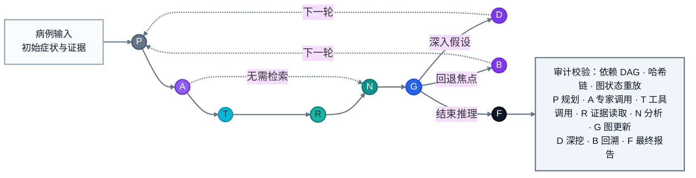

# TraceEvo 审计溯源图

横向简图：每种关键事件只画一个圆形字母节点，圆形、字母和颜色参照项目 `PROV_STYLE`，事件全称见图例。实线表示本轮事件依赖；虚线表示无需检索的可选路径或深挖/回溯后进入下一轮。因多轮执行会重复同类事件，图中将后续轮次折叠到同一个事件节点，不表示真实事件 DAG 存在环。

```mermaid
%%{init: {"theme":"base","themeVariables":{"fontFamily":"Arial, sans-serif","fontSize":"18px","lineColor":"#64748b","textColor":"#0f172a"}}}%%
flowchart LR
    case_input["病例输入<br/>初始症状与证据"] --> plan((P))
    plan --> agent_call((A))
    agent_call --> tool_call((T))
    tool_call --> evidence_read((R))
    evidence_read --> analysis((N))
    agent_call -. "无需检索" .-> analysis
    analysis --> graph_update((G))

    graph_update -->|深入假设| drill_down((D))
    graph_update -->|回退焦点| backtrack((B))
    graph_update -->|结束推理| final_report((F))
    drill_down -. "下一轮" .-> plan
    backtrack -. "下一轮" .-> plan
    final_report --> audit_check["审计校验：依赖 DAG · 哈希链 · 图状态重放<br/>P 规划 · A 专家调用 · T 工具调用 · R 证据读取 · N 分析 · G 图更新<br/>D 深挖 · B 回溯 · F 最终报告"]

    classDef input fill:#f8fafc,stroke:#94a3b8,color:#0f172a,stroke-width:2px,font-size:16px;
    classDef plan fill:#64748b,stroke:#475569,color:#ffffff,stroke-width:2px,font-size:16px;
    classDef agentCall fill:#8b5cf6,stroke:#6d28d9,color:#ffffff,stroke-width:2px,font-size:16px;
    classDef toolCall fill:#06b6d4,stroke:#0891b2,color:#083344,stroke-width:2px,font-size:16px;
    classDef evidenceRead fill:#14b8a6,stroke:#0f766e,color:#042f2e,stroke-width:2px,font-size:16px;
    classDef analysis fill:#0d9488,stroke:#0f766e,color:#ffffff,stroke-width:2px,font-size:16px;
    classDef graphUpdate fill:#2563eb,stroke:#1d4ed8,color:#ffffff,stroke-width:2px,font-size:16px;
    classDef branchEvent fill:#7c3aed,stroke:#6d28d9,color:#ffffff,stroke-width:2px,font-size:16px;
    classDef report fill:#0f172a,stroke:#020617,color:#ffffff,stroke-width:2px,font-size:16px;
    classDef audit fill:#f1f5f9,stroke:#64748b,color:#0f172a,stroke-width:2px,font-size:16px;

    class case_input input;
    class plan plan;
    class agent_call agentCall;
    class tool_call toolCall;
    class evidence_read evidenceRead;
    class analysis analysis;
    class graph_update graphUpdate;
    class drill_down,backtrack branchEvent;
    class final_report report;
    class audit_check audit;

    linkStyle default stroke:#64748b,stroke-width:2px;
```
